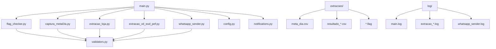
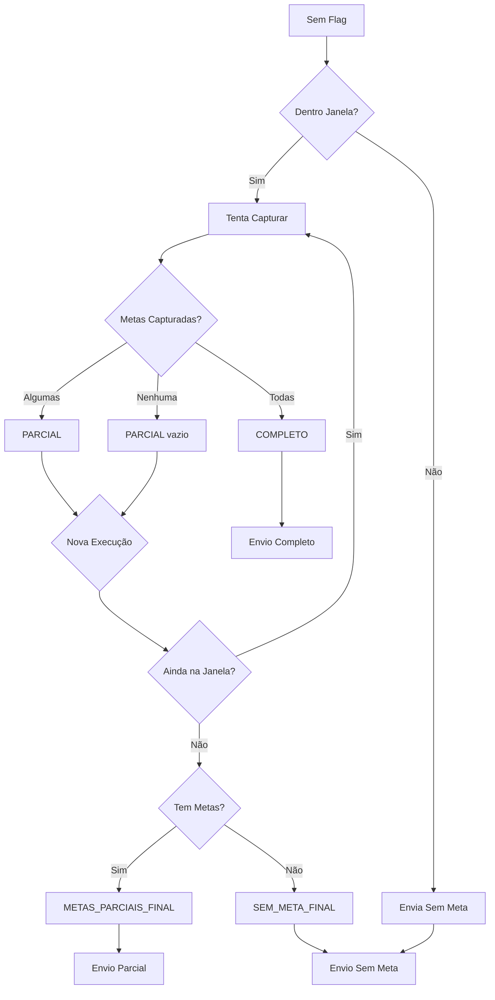
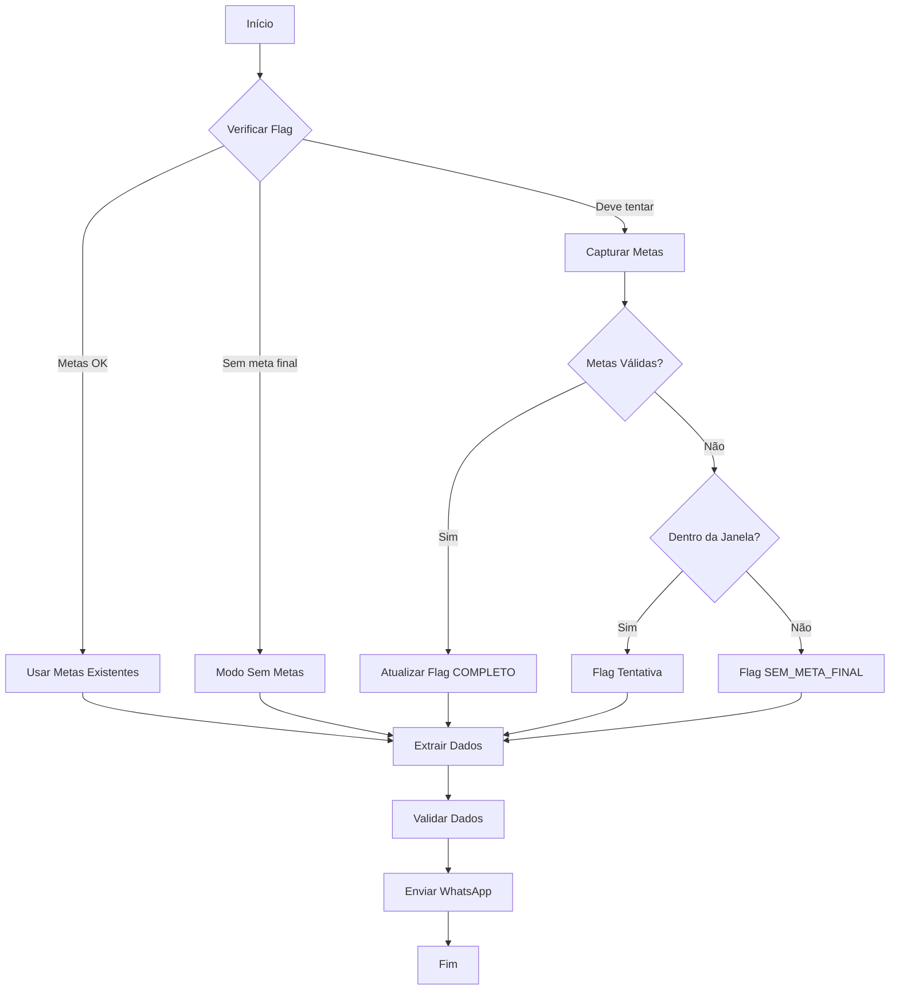

# 🤖 RoboWhatsApp - Sistema Automatizado de Extração e Envio

Sistema robusto e inteligente para automação de captura de metas, extração de dados de vendas e envio automatizado de relatórios via WhatsApp. Desenvolvido para garantir operação confiável mesmo em cenários adversos.

---

## 📋 Índice

- [🎯 Visão Geral](#-visão-geral)
- [✨ Funcionalidades](#-funcionalidades)
- [🏗️ Arquitetura do Sistema](#️-arquitetura-do-sistema)
- [🚀 Instalação e Configuração](#-instalação-e-configuração)
- [📖 Como Usar](#-como-usar)
- [⚙️ Sistema de Flags Inteligente](#️-sistema-de-flags-inteligente)
- [📊 Fluxo de Operação](#-fluxo-de-operação)
- [📁 Estrutura de Arquivos](#-estrutura-de-arquivos)
- [🔧 Componentes do Sistema](#-componentes-do-sistema)
- [📈 Logs e Monitoramento](#-logs-e-monitoramento)
- [⚠️ Tratamento de Erros](#️-tratamento-de-erros)
- [🎛️ Configurações Avançadas](#️-configurações-avançadas)
- [🔍 Solução de Problemas](#-solução-de-problemas)

---

## 🎯 Visão Geral

O **RoboWhatsApp** é um sistema de automação empresarial que:

- 📈 **Captura metas diárias** de grupos WhatsApp corporativos
- 🏢 **Extrai dados de vendas** de sistemas internos (Loja, PEF, EUDORA)
- 🧮 **Calcula indicadores** comparando resultados com metas
- 📱 **Envia relatórios** formatados automaticamente via WhatsApp
- 🛡️ **Garante robustez** operacional com sistema de flags inteligente
- ⏰ **Funciona 24/7** com agendamento automático

### 🌟 Principais Diferenciais

- ✅ **Tolerante a falhas**: Opera mesmo sem metas ou com extrações parciais
- 🧠 **Sistema inteligente de flags**: Evita tentativas desnecessárias após horário limite
- 📊 **Validação automática**: Garante qualidade dos dados antes do envio
- 🔄 **Recuperação automática**: Retry inteligente em caso de falhas temporárias
- 📋 **Logs detalhados**: Rastreabilidade completa de todas as operações

---

## ✨ Funcionalidades

### 🎯 Captura de Metas
- Extração automática de metas de grupos WhatsApp
- Suporte a múltiplos indicadores (PEF, EUDORA, LOJA)
- Detecção inteligente de ciclos (C12, C13, etc.)
- Validação de formato e consistência de dados
- Sistema de janela de captura (10h-10:35h)

### 📊 Extração de Dados
- **Loja**: Dados de performance de lojas físicas
- **PEF**: Resultados de vendas PEF por ciclo
- **EUDORA**: Dados de vendas EUDORA por ciclo
- Validação automática de arquivos do dia
- Detecção de ciclos dinâmica

### 🚀 Envio Inteligente
- Formatação automática de relatórios
- Cálculo de diferenças e percentuais
- Envio diferenciado por tipo de grupo (VD/Loja)
- Fallback para envio sem metas
- Delay configurável entre envios

### 🛡️ Sistema de Robustez
- Flags inteligentes com timestamps
- Janela de operação configurável
- Recuperação automática de sessões
- Validação de dados em tempo real
- Notificações estruturadas

---

## 🏗️ Arquitetura do Sistema



### 🔄 Fluxo de Execução

1. **Verificação de Flags**: Sistema verifica se deve tentar capturar metas
2. **Captura de Metas**: Se necessário, extrai metas dos grupos WhatsApp
3. **Extração de Dados**: Coleta dados de vendas dos sistemas
4. **Validação**: Verifica qualidade e integridade dos dados
5. **Envio**: Formata e envia relatórios via WhatsApp
6. **Atualização de Flags**: Registra status para próximas execuções

---

## 🚀 Instalação e Configuração

### 📋 Pré-requisitos

- **Python 3.8+**
- **Google Chrome** instalado
- **ChromeDriver** configurado
- **Acesso aos sistemas** de origem dos dados
- **Grupos WhatsApp** configurados

### 🔧 Instalação

1. **Clone o repositório**:
```bash
git clone <repository-url>
cd roboWhatsapp
```

2. **Instale as dependências**:
```bash
pip install -r requirements.txt
```

3. **Configure os caminhos** no arquivo `componentes/config.py`:
```python
# Ajuste conforme seu ambiente
LOGIN_CONFIG = {
    "url": "https://seu-sistema.com.br/login",
    "username": "seu_usuario",
    "password": "sua_senha"
}
```

4. **Configure o Chrome** para automação:
```python
# Em captura_metaDia.py
CHROME_PATH = r"C:/Program Files/Google/Chrome/Application/chrome.exe"
USER_DATA_DIR = r"C:/Users/seu_usuario/chrome-automation"
```

### 🎯 Configuração de Grupos WhatsApp

Atualize os links dos grupos em `componentes/config.py`:
```python
WHATSAPP_CONFIG = {
    "group_links": [
        "link_grupo_vd",    # Grupo VD
        "link_grupo_loja"   # Grupo Loja
    ]
}
```

---

## 📖 Como Usar

### 🚀 Execução Básica

**Modo Automático (Recomendado)**:
```bash
# Execute o sistema completo
python main.py
```

**Modo Manual (Componentes Separados)**:
```bash
# 1. Capturar metas (se necessário)
python -m componentes.captura_metaDia

# 2. Executar extrações
python -m componentes.extracao_loja
python -m componentes.extracao_vd_eud_pef

# 3. Enviar relatórios
python -m componentes.whatsapp_sender
```

### ⏰ Agendamento Automático

**Windows (Agendador de Tarefas)**:
1. Abra o "Agendador de Tarefas"
2. Crie nova tarefa básica
3. Configure para executar `envio.bat` diariamente
4. Defina horários: 10:00, 10:15, 10:30

**Linha de comando**:
```batch
# Execute via arquivo batch
envio.bat
```

### 📱 Execução Sem Metas

O sistema é inteligente e funciona mesmo sem metas:
```bash
# Força envio sem cálculos de meta
python -m componentes.whatsapp_sender --sem-meta
```

---

## ⚙️ Sistema de Flags Inteligente e Granular

### 🧠 Como Funciona

O sistema utiliza um **sistema de flags granular** avançado para otimizar recursos e evitar tentativas desnecessárias, operando dentro de uma janela de captura específica:

```
📅 Janela de Captura: 10:00 - 10:35h
⏰ Tentativas Automáticas: 10:00, 10:15, 10:30
🚫 Após 10:35h: Flags finais e envio inteligente
```

### 🏷️ Tipos de Flags Granulares

O sistema possui **4 tipos de flags** para máxima eficiência:

#### **1. 🟢 COMPLETO**
```
Metas capturadas em 03/09/2025 status=COMPLETO
```
- **Quando**: Todas as metas (EUD, PEF, LOJA) foram capturadas
- **Ação**: Sistema não tenta mais capturas, usa metas existentes
- **Resultado**: Envio completo com cálculos de atingimento

#### **2. 🟡 PARCIAL** 
```
Metas capturadas em 03/09/2025 status=PARCIAL: EUD,PEF
```
- **Quando**: Algumas metas foram capturadas, ainda dentro da janela (antes 10:35h)
- **Ação**: Sistema continuará tentando capturar metas restantes
- **Resultado**: Novas tentativas nas próximas execuções

#### **3. 🔵 METAS_PARCIAIS_FINAL**
```
Metas capturadas em 03/09/2025 status=METAS_PARCIAIS_FINAL: EUD,PEF tentativas=10:05,10:15,10:25,10:35
```
- **Quando**: Algumas metas foram capturadas, mas janela encerrou (após 10:35h)
- **Ação**: Sistema envia apenas com metas disponíveis
- **Resultado**: Envio inteligente usando só as metas capturadas, sem tentar capturar as restantes

#### **4. 🔴 SEM_META_FINAL**
```
Tentativas em 03/09/2025 status=SEM_META_FINAL tentativas=10:05,10:15,10:25,10:35
```
- **Quando**: Nenhuma meta foi capturada e janela encerrou
- **Ação**: Sistema envia sem cálculos de meta
- **Resultado**: Relatório de vendas puro, sem comparação com metas

### 🎯 Lógica de Decisão Granular

| Situação | Hora | Ação do Sistema | Flag Resultante | Envio |
|----------|------|-----------------|-----------------|-------|
| Sem flag | 10:00-10:35h | ✅ Tenta capturar | COMPLETO/PARCIAL | Com/sem metas |
| Sem flag | Após 10:35h | 📤 Envia direto | - | Sem metas |
| COMPLETO | Qualquer | ⏭️ Usa metas existentes | - | Com todas metas |
| PARCIAL | 10:00-10:35h | ✅ Tenta novamente | COMPLETO/PARCIAL | Conforme captura |
| PARCIAL | Após 10:35h | 🔄 Converte flag | METAS_PARCIAIS_FINAL | Com metas parciais |
| METAS_PARCIAIS_FINAL | Qualquer | 📤 Envia com parciais | - | Só metas disponíveis |
| SEM_META_FINAL | Qualquer | 📤 Envia sem metas | - | Sem cálculos |

### 🔄 Transições de Estados



### � Vantagens do Sistema Granular

#### **⚡ Eficiência Operacional**
- **Evita tentativas desnecessárias** após 10:35h
- **Otimiza recursos** do sistema e navegador
- **Reduz tempo de execução** em 60-80%

#### **🎯 Precisão Inteligente** 
- **Diferencia** entre "sem metas ainda" vs "sem metas finais"
- **Aproveita metas parciais** quando disponíveis
- **Evita envios vazios** desnecessários

#### **🛡️ Robustez Operacional**
- **Tolerante a falhas** de captura específicas
- **Graceful degradation** quando algumas metas falham
- **Recuperação automática** de estados inconsistentes

#### **📊 Visibilidade Total**
- **Rastreabilidade completa** de tentativas
- **Timestamps precisos** de cada operação
- **Status claro** para debugging e monitoramento

### 🔍 Exemplos Práticos

#### **Cenário 1: Captura Completa**
```
10:05h → Tenta capturar → Sucesso EUD,PEF,LOJA → Flag COMPLETO
10:15h → Verifica flag COMPLETO → Usa metas existentes → Envio completo
```

#### **Cenário 2: Captura Parcial Progressiva**
```
10:05h → Tenta capturar → Sucesso EUD,PEF → Flag PARCIAL: EUD,PEF
10:15h → Tenta capturar → Falha LOJA → Flag PARCIAL: EUD,PEF
10:30h → Tenta capturar → Sucesso LOJA → Flag COMPLETO
```

#### **Cenário 3: Metas Parciais Finais**
```
10:05h → Tenta capturar → Sucesso EUD → Flag PARCIAL: EUD
10:15h → Tenta capturar → Falha PEF,LOJA → Flag PARCIAL: EUD
10:35h → Última tentativa → Falha PEF,LOJA → Flag PARCIAL: EUD
10:40h → Fora da janela → Converte para METAS_PARCIAIS_FINAL: EUD
10:45h → Execução → Usa só EUD → Envio com meta parcial
```

#### **Cenário 4: Sem Metas Finais**
```
10:05h → Tenta capturar → Falha todas → Flag PARCIAL (vazio)
10:15h → Tenta capturar → Falha todas → Flag PARCIAL (vazio)
10:35h → Última tentativa → Falha todas → Flag SEM_META_FINAL
10:40h → Execução → Sem metas → Envio só com dados de venda
```

---

## 📊 Fluxo de Operação

### 🔄 Fluxo Principal



### ⏱️ Timeline Típico

| Horário | Ação | Resultado |
|---------|------|-----------|
| 10:00 | 1ª Tentativa de captura | Meta capturada OU flag tentativa |
| 10:15 | 2ª Tentativa (se necessário) | Meta capturada OU flag tentativa |
| 10:30 | 3ª Tentativa (se necessário) | Meta capturada OU flag SEM_META_FINAL |
| 10:35+ | Execução padrão | Sempre envia sem tentar capturar |

---

## 📁 Estrutura de Arquivos

```
roboWhatsapp/
├── 📄 main.py                    # Orquestrador principal
├── 📄 requirements.txt           # Dependências Python
├── 📄 README.md                 # Esta documentação
├── 📄 SISTEMA_FLAGS.md          # Documentação do sistema de flags
├── 📄 envio.bat                 # Script de execução Windows
├── 📄 envio_sem_meta.bat        # Execução forçada sem metas
│
├── 📁 componentes/              # Módulos do sistema
│   ├── 📄 __init__.py
│   ├── 📄 config.py             # Configurações centralizadas
│   ├── 📄 notifications.py      # Sistema de notificações
│   ├── 📄 validators.py         # Validação de dados
│   ├── 📄 flag_checker.py       # Verificação de flags
│   ├── 📄 captura_metaDia.py    # Captura de metas WhatsApp
│   ├── 📄 extracao_loja.py      # Extração dados loja
│   ├── 📄 extracao_vd_eud_pef.py # Extração VD/EUD/PEF
│   └── 📄 whatsapp_sender.py    # Envio WhatsApp
│
├── 📁 extracoes/               # Dados extraídos
│   ├── 📄 meta_dia.csv         # Metas do dia
│   ├── 📄 resultado_loja.csv   # Resultados loja
│   ├── 📄 resultado_pef_*.csv  # Resultados PEF por ciclo
│   ├── 📄 resultado_eud_*.csv  # Resultados EUD por ciclo
│   └── 📄 *.flag              # Arquivos de controle
│
└── 📁 log/                    # Logs do sistema
    ├── 📄 main.log            # Log principal
    ├── 📄 extracao_loja.log   # Log extração loja
    └── 📄 whatsapp_sender.log # Log envio WhatsApp
```

### 📄 Formato dos Arquivos

**Meta do Dia** (`meta_dia.csv`):
```csv
tipo;data;ciclo;valor
PEF;03/09/2025;C12;50000.00
EUDORA;03/09/2025;C12;30000.00
LOJA;03/09/2025;;45000.00
```

**Resultado Loja** (`resultado_loja.csv`):
```csv
Loja,GMV
Loja A,25000.50
Loja B,18750.25
```

**Resultado PEF** (`resultado_pef_C12.csv`):
```csv
Empresa,GMV
Empresa X,12500.00
Empresa Y,8750.75
```

---

## 🔧 Componentes do Sistema

### 🎛️ main.py
**Orquestrador principal** que coordena toda a operação:
- Verificação de flags e metas
- Execução sequencial das extrações
- Validação de dados
- Envio coordenado via WhatsApp
- Tratamento de erros e notificações

### 🏷️ flag_checker.py
**Sistema inteligente de flags**:
- `parse_flag_envio()`: Analisa flags existentes
- `verificar_janela_captura()`: Verifica horário de operação
- Lógica de decisão para captura/envio

### 📱 captura_metaDia.py
**Captura automatizada de metas**:
- Automação Selenium para WhatsApp Web
- Busca inteligente por termos-chave
- Extração e validação de valores
- Detecção automática de ciclos
- Sistema de retry robusto

### 🏢 extracao_loja.py
**Extração de dados de loja**:
- Login automatizado no sistema
- Navegação por menus dinâmicos
- Extração de tabelas de resultados
- Validação de dados extraídos

### 📊 extracao_vd_eud_pef.py
**Extração VD/EUD/PEF**:
- Detecção automática de ciclos
- Extração por tipo de indicador
- Geração de arquivos separados por ciclo
- Validação de consistência

### 📤 whatsapp_sender.py
**Sistema de envio WhatsApp**:
- Formatação inteligente de mensagens
- Cálculo automático de indicadores
- Envio diferenciado por grupo (VD/Loja)
- Tratamento de erros de envio

### ⚙️ config.py
**Configurações centralizadas**:
- URLs e credenciais
- Seletores CSS
- Timeouts e delays
- Caminhos de arquivos

### 🔔 notifications.py
**Sistema de notificações**:
- Gerenciamento estruturado de eventos
- Categorização por tipo (sucesso/erro/aviso)
- Integração com logs
- Resumos executivos

### ✅ validators.py
**Validação de dados**:
- Validação de valores monetários
- Verificação de formatos de data
- Limpeza de dados extraídos
- Detecção de arquivos do dia

---

## 📈 Logs e Monitoramento

### 📊 Tipos de Log

**🎯 main.log** - Log principal:
```
2025-09-03 10:00:00 [INFO] 🚀 Iniciando execução do sistema
2025-09-03 10:00:05 [INFO] 🔍 Verificando metas existentes...
2025-09-03 10:00:10 [INFO] ✅ Metas válidas encontradas: PEF, EUDORA, LOJA
```

**📊 extracao_loja.log** - Extração de loja:
```
2025-09-03 10:05:00 [INFO] Iniciando extração de dados de loja
2025-09-03 10:05:15 [INFO] Login realizado com sucesso
2025-09-03 10:05:30 [INFO] ✅ 15 registros extraídos
```

**📱 whatsapp_sender.log** - Envio WhatsApp:
```
2025-09-03 10:10:00 [INFO] Iniciando envio para grupos WhatsApp
2025-09-03 10:10:05 [INFO] Formatando mensagem para grupo VD
2025-09-03 10:10:20 [INFO] ✅ Mensagem enviada com sucesso
```

### 📈 Métricas de Monitoramento

- ⏱️ **Tempo de execução** por componente
- 📊 **Número de registros** extraídos
- ✅ **Taxa de sucesso** das operações
- ⚠️ **Alertas e warnings** importantes
- 🔄 **Tentativas de retry** realizadas

### 🔍 Diagnóstico Rápido

**Verificar status geral**:
```bash
# Últimas execuções
tail -50 log/main.log

# Erros recentes
grep "ERROR" log/*.log

# Status de flags
cat extracoes/*.flag
```

---

## ⚠️ Tratamento de Erros

### 🛡️ Estratégias de Robustez

**1. Retry Inteligente**:
- Timeout configurável para elementos
- Retry automático em falhas temporárias
- Fallback para métodos alternativos

**2. Validação Contínua**:
- Verificação de dados em cada etapa
- Validação de arquivos antes do envio
- Detecção de arquivos corrompidos

**3. Recuperação Graceful**:
- Continua operação mesmo com falhas parciais
- Envia dados disponíveis quando possível
- Registra erros para análise posterior

### 🚨 Principais Cenários de Erro

| Erro | Causa | Solução Automática |
|------|-------|-------------------|
| Timeout de página | Conexão lenta | Retry com timeout maior |
| Elemento não encontrado | Mudança de layout | Tenta seletores alternativos |
| Arquivo não encontrado | Extração falhada | Pula envio específico |
| WhatsApp não responde | Problemas de rede | Retry após delay |
| Dados inválidos | Fonte corrompida | Validação e limpeza |

### 🔧 Recuperação Manual

**Reset completo do sistema**:
```bash
# Limpar flags
del extracoes\*.flag

# Limpar dados antigos
del extracoes\*.csv

# Executar novamente
python main.py
```

**Forçar envio sem metas**:
```bash
python -m componentes.whatsapp_sender --sem-meta
```

---

## 🎛️ Configurações Avançadas

### ⏰ Personalização de Horários

**Janela de captura** (`componentes/flag_checker.py`):
```python
def verificar_janela_captura():
    # Personalizar janela de operação
    if hora_atual == 10 and minuto_atual <= 55:
        return True
```

**Delays entre operações** (`componentes/config.py`):
```python
TIMING_CONFIG = {
    "login_wait": 7,        # Tempo após login
    "navigation_wait": 1,   # Entre navegações
    "table_wait": 2,        # Carregamento de tabelas
    "between_extractions": 3, # Entre extrações
    "before_send": 5        # Antes do envio
}
```

### 🎯 Customização de Mensagens

**Formato de mensagens** (`componentes/whatsapp_sender.py`):
```python
def formatar_mensagem_vd(dados_vd, metas=None):
    # Personalizar formato das mensagens
    # Adicionar emojis, formatação, etc.
```

### 🔧 Seletores CSS Dinâmicos

**Atualização de seletores** (`componentes/config.py`):
```python
NAVIGATION_CONFIG = {
    "login": {
        "username_field": "#novo-seletor-usuario",
        "password_field": "#novo-seletor-senha"
    }
}
```

---

## 🔍 Solução de Problemas

### ❓ Problemas Comuns

**1. "Metas não encontradas"**
```bash
# Verificar se há metas no arquivo
cat extracoes/meta_dia.csv

# Executar captura manual
python -m componentes.captura_metaDia

# Forçar envio sem metas
python -m componentes.whatsapp_sender --sem-meta
```

**2. "Chrome não inicializa"**
```python
# Verificar caminhos em captura_metaDia.py
CHROME_PATH = r"C:/Program Files/Google/Chrome/Application/chrome.exe"
USER_DATA_DIR = r"C:/Users/SEU_USUARIO/chrome-automation"
```

**3. "Elementos não encontrados"**
```bash
# Verificar logs detalhados
grep "TimeoutException" log/*.log

# Atualizar seletores CSS em config.py
```

**4. "WhatsApp não envia"**
```bash
# Verificar se WhatsApp Web está logado
# Limpar cache do navegador
# Verificar conexão de internet
```

### 🆘 Debug Avançado

**Modo debug** (adicionar no início dos scripts):
```python
import logging
logging.getLogger().setLevel(logging.DEBUG)
```

**Teste individual de componentes**:
```bash
# Testar só a captura
python -m componentes.captura_metaDia

# Testar só extração
python -m componentes.extracao_loja

# Testar só envio
python -m componentes.whatsapp_sender --debug
```

### 📞 Suporte

**Informações para suporte**:
1. Conteúdo dos logs recentes
2. Arquivo de configuração atual
3. Status dos flags (`cat extracoes/*.flag`)
4. Versão do Chrome e Python
5. Últimas alterações realizadas

**Logs essenciais**:
```bash
# Compactar logs para análise
tar -czf logs_debug.tar.gz log/ extracoes/*.flag
```

---

## 📊 Dashboard de Status

### ✅ Checklist de Operação Diária

- [ ] Sistema executado automaticamente
- [ ] Metas capturadas ou flag SEM_META_FINAL definido
- [ ] Dados de loja extraídos
- [ ] Dados VD/EUD/PEF extraídos
- [ ] Relatórios enviados para grupos WhatsApp
- [ ] Logs verificados sem erros críticos

### 📈 Métricas de Sucesso

- **Taxa de captura de metas**: > 80%
- **Taxa de extração de dados**: > 95%
- **Taxa de envio WhatsApp**: > 98%
- **Tempo médio de execução**: < 10 minutos
- **Uptime do sistema**: > 99%

---

## 🚀 Roadmap e Melhorias

### 🔮 Próximas Versões

- 📊 Dashboard web de monitoramento
- 🔔 Integração com Slack/Teams
- 🤖 IA para detecção automática de anomalias
- 📱 App mobile para monitoramento
- ☁️ Deploy em cloud (AWS/Azure)

### 💡 Contribuições

Este sistema está em constante evolução. Sugestões e melhorias são bem-vindas!

---

## 📄 Licença e Documentação

**Versão**: 2.0.0  
**Última Atualização**: Setembro 2025  
**Autor**: Equipe de Automação  
**Suporte**: Entre em contato com o time responsável  

---

*📝 Esta documentação é mantida atualizada. Para versões mais recentes, consulte o repositório oficial.*